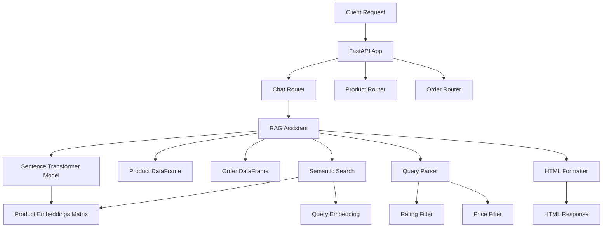

# E-Commerce RAG Chatbot 專案報告（後端與 LLM 重點）

## 1. 專案概述

### 1.1 系統目標
本專案是一個基於 RAG (Retrieval-Augmented Generation) 技術的電商聊天機器人後端系統，主要實現：

### 1.2 核心設計策略 (Core Design Strategy)

#### 1.2.1 混合搜索策略 (Hybrid Search)
為了兼顧語義理解的靈活性與商業邏輯的精確性，本系統採用「嵌入模型 + 規則引擎」的混合架構：
- **向量搜索 (Recall)**: 使用 `all-MiniLM-L6-v2` 嵌入模型計算語義相似度，解決傳統關鍵字匹配無法處理同義詞（如 "microphone" ↔ "audio device"）的問題。
- **規則過濾 (Precision)**: 針對價格、評分等剛性需求，使用 Python 腳本進行精確的數值過濾，彌補小型嵌入模型缺乏邏輯推理能力的短板。

#### 1.2.2 本地化小模型優勢 (Local Small Model Strategy)
不同於目前主流的雲端 LLM RAG 方案，本專案選擇在本地端運行輕量級模型，主要基於以下考量：
1.  **資料隱私與資安 (Data Security)**: 所有數據處理與向量檢索完全在本地伺服器完成，敏感數據（如庫存、訂單、銷售策略）無需傳送至第三方 API，徹底消除資料外洩風險。
2.  **成本與效率**: 輕量級模型 (`~80MB`) 可在普通 CPU 上高效運行，無需昂貴的 GPU 算力或 Token 費用，且無網路延遲，適合高併發的電商搜索場景。

### 1.3 核心功能亮點
- **語義產品搜索**：使用自然語言查詢產品，支援價格和評分過濾
- **訂單管理**：查詢客戶訂單歷史和高優先級訂單
- **產品推薦**：基於語義相似度的產品推薦
- **智能查詢解析**：從自然語言中自動提取過濾條件
- **AI 虛擬試穿 (Virtual Try-On)**: 整合 Hugging Face 雲端算力，提供快速的虛擬試穿體驗。

### 1.4 系統架構
```
┌──────────────┐         ┌─────────────┐         ┌──────────────┐
│  FastAPI     │ ──────> │  RAG Engine │ ──────> │  Embedding   │
│   Backend    │         │  (Assistant)│         │   Model      │
└──────────────┘         └─────────────┘         └──────────────┘
       │                        │                        │
       │                        │                        │
       ▼                        ▼                        ▼
┌──────────────┐         ┌─────────────┐         ┌──────────────┐
│  API Routes  │         │  Product DB │         │  Order DB    │
│  (Endpoints) │         │    (CSV)    │         │    (CSV)     │
└──────────────┘         └─────────────┘         └──────────────┘
```

## 2. 技術棧

### 2.1 核心框架與庫
- **FastAPI** (v0.95.1): RESTful API 框架
  - 檔案位置: `backend/src/api/main.py`
  - 用途: 提供 RESTful API 端點，處理 HTTP 請求
  - 實現: 配置 CORS、註冊路由、健康檢查端點

- **Uvicorn** (v0.22.0): ASGI 伺服器
  - 用途: 運行 FastAPI 應用

- **Pandas** (v2.0.1): 資料處理
  - 檔案位置: `backend/src/rag/assistant.py` (第 1, 19-20 行)
  - 用途: 載入和處理 CSV 資料，進行資料篩選和排序

- **NumPy**: 數值計算和向量運算
  - 檔案位置: `backend/src/rag/assistant.py` (第 2, 222 行)
  - 用途: 計算向量相似度（點積運算）

### 2.2 ML/NLP 技術
- **Sentence Transformers** (v2.2.2): 文字嵌入模型庫
  - 檔案位置: `backend/src/rag/assistant.py` (第 6, 30, 39 行)
  - 用途: 載入和使用預訓練的嵌入模型

- **PyTorch** (v2.0.1): 深度學習框架
  - 用途: Sentence Transformers 的底層框架

- **Transformers** (v4.29.2): Hugging Face 模型庫
  - 用途: 提供模型載入和轉換功能

## 3. 模型下載與管理

### 3.1 使用的模型
**all-MiniLM-L6-v2** (Sentence Transformer)
- **模型類型**: 文字嵌入模型 (Text Embedding Model)
- **用途**: 將產品標題和描述轉換為 384 維向量，用於語義搜索
- **模型大小**: 約 80-90 MB
- **特點**: 輕量級、快速、適合語義搜索任務

### 3.2 模型下載與本地化管理
**實現位置**: `backend/src/rag/assistant.py` (第 22-39 行)

**實現邏輯**:
```python
# 1. 設置本地模型路徑
base_dir = Path(__file__).parent.parent.parent  # backend 目錄
local_model_dir = base_dir / "models" / model_name

# 2. 檢查本地模型是否存在
if not local_model_dir.exists() or not any(local_model_dir.iterdir()):
    # 首次運行：從 Hugging Face 下載
    temp_model = SentenceTransformer(model_name)
    local_model_dir.parent.mkdir(parents=True, exist_ok=True)
    temp_model.save(str(local_model_dir))  # 保存到本地
    self.model = temp_model
else:
    # 之後運行：直接從本地載入
    self.model = SentenceTransformer(str(local_model_dir))
```

**實現細節**:
- 自動檢測本地模型目錄是否存在
- 首次運行時自動從 Hugging Face 下載模型
- 下載後保存到 `backend/models/all-MiniLM-L6-v2/` 目錄
- 之後運行直接從本地載入，避免重複下載，提升啟動速度
- 使用 Path 物件進行路徑管理，確保跨平台兼容性

**配置位置**: `backend/src/config.py` (第 30-31 行)
- `EMBEDDING_MODEL`: 模型名稱配置
- `MODEL_DIR`: 模型儲存目錄配置

## 4. RAG 系統實現

### 4.1 RAG 架構說明
RAG (Retrieval-Augmented Generation) 在本專案中的實現分為兩個階段：

#### 4.1.1 檢索 (Retrieval) 階段
**實現位置**: `backend/src/rag/assistant.py` (第 86-92 行)

**實現內容**:
```python
def _create_product_embeddings(self):
    # 1. 組合產品標題和描述為單一文字
    texts = self.product_df.apply(
        lambda x: f"{x['Product_Title']} {x['Description']}", 
        axis=1
    ).tolist()
    
    # 2. 使用模型將所有產品文字轉換為嵌入向量
    self.product_embeddings = self.model.encode(texts)
```

**實現細節**:
- 將每個產品的標題和描述合併成單一文字字串
- 使用 `all-MiniLM-L6-v2` 模型將所有產品文字批量編碼為向量
- 結果儲存在 `self.product_embeddings` 中，形狀為 `(產品數量, 384)`
- 在系統初始化時執行一次，之後所有查詢都使用這個預計算的嵌入矩陣

#### 4.1.2 生成 (Generation) 階段
**實現位置**: `backend/src/rag/assistant.py` (第 217-239 行)

**實現內容**:
```python
def semantic_search(self, query: str, min_rating: Optional[float] = None, 
                    max_price: Optional[float] = None):
    # 1. 將用戶查詢轉換為嵌入向量
    query_embedding = self.model.encode(query)  # 第 221 行
    
    # 2. 計算查詢向量與所有產品向量的相似度（點積）
    similarities = np.dot(self.product_embeddings, query_embedding)  # 第 222 行
    
    # 3. 將相似度分數添加到 DataFrame
    results_df = self.product_df.copy()
    results_df['similarity'] = similarities
    
    # 4. 應用過濾器
    if min_rating is not None:
        results_df = results_df[results_df['Rating'] >= min_rating]  # 第 230 行
    if max_price is not None:
        results_df = results_df[results_df['Price'] <= max_price]  # 第 234 行
    
    # 5. 按相似度排序並返回 Top 5
    results_df = results_df.sort_values('similarity', ascending=False).head(5)  # 第 237 行
```

**實現細節**:
- 使用點積 (dot product) 計算餘弦相似度（因為向量已正規化）
- 相似度分數範圍通常在 -1 到 1 之間，分數越高表示語義越相似
- 支援動態過濾：評分過濾和價格過濾
- 返回最相似的 5 個產品

### 4.2 資料預處理
**實現位置**: `backend/src/rag/assistant.py` (第 44-84 行)

**實現內容**:
1. **NaN 值處理** (第 46-53 行)
   - 根據資料類型填充 NaN 值
   - 字串欄位填充空字串，避免後續處理錯誤

2. **欄位名稱統一** (第 55-67 行)
   - 支援原始資料格式和處理過的資料格式
   - 自動映射欄位名稱（如 `title` → `Product_Title`）
   - 確保系統能處理不同格式的輸入資料

3. **日期時間處理** (第 69-84 行)
   - 處理訂單日期時間欄位
   - 支援合併 `Order_Date` 和 `Time` 欄位
   - 轉換為 pandas Timestamp 格式，便於排序和查詢

**實現細節**:
- 使用條件判斷自動識別資料格式
- 確保資料一致性，避免後續處理錯誤
- 對訂單資料按時間降序排序，最新的訂單在前

## 5. 查詢處理系統

### 5.1 查詢處理主流程
**實現位置**: `backend/src/rag/assistant.py` (第 241-307 行)

**流程說明**:
```
用戶查詢輸入
    │
    ├─> 轉換為小寫 (第 244 行)
    │
    ├─> 提取評分過濾條件 (第 246-256 行)
    │   └─> 識別 "above X.X" 模式
    │
    ├─> 提取價格過濾條件 (第 258-274 行)
    │   └─> 識別 "under $X", "below $X" 等關鍵字
    │
    ├─> 查詢類型判斷
    │   ├─> 高優先級訂單查詢? (第 277-279 行)
    │   │   └─> 返回高優先級訂單列表
    │   │
    │   ├─> 一般訂單查詢? (第 282-289 行)
    │   │   └─> 檢查 customer_id → 返回客戶訂單
    │   │
    │   └─> 產品查詢 (第 292-307 行)
    │       └─> 語義搜索 → 格式化結果
```

### 5.2 智能查詢解析

#### 5.2.1 評分過濾提取
**實現位置**: `backend/src/rag/assistant.py` (第 246-256 行)

**實現內容**:
```python
min_rating = None
if 'above' in query_lower and any(char.isdigit() for char in query_lower):
    try:
        # 找到 "above" 關鍵字位置
        rating_idx = query_lower.find('above') + 5
        # 提取後續的數字（支援小數）
        rating_str = ''.join(c for c in query_lower[rating_idx:] if c.isdigit() or c == '.')
        if rating_str:
            min_rating = float(rating_str)
    except ValueError:
        pass
```

**實現細節**:
- 識別 "above" 關鍵字
- 使用字串處理提取評分值
- 支援整數和小數（如 4.5）
- 錯誤處理：如果提取失敗，不影響其他功能

**範例**:
- "Show me products above 4.5" → `min_rating = 4.5`
- "microphones above 4.0" → `min_rating = 4.0`

#### 5.2.2 價格過濾提取
**實現位置**: `backend/src/rag/assistant.py` (第 258-274 行)

**實現內容**:
```python
max_price = None
price_keywords = ['under', 'below', 'less than', 'cheaper than', 'up to']
for keyword in price_keywords:
    if keyword in query_lower:
        try:
            # 找到關鍵字位置
            keyword_idx = query_lower.find(keyword) + len(keyword)
            # 提取後續 20 個字元
            price_part = query_lower[keyword_idx:keyword_idx+20]
            # 使用正則表達式提取價格數字（支援 $ 符號）
            price_match = re.search(r'\$?\s*(\d+(?:\.\d+)?)', price_part)
            if price_match:
                max_price = float(price_match.group(1))
                break
        except (ValueError, AttributeError):
            pass
```

**實現細節**:
- 支援多種價格關鍵字：under, below, less than, cheaper than, up to
- 使用正則表達式 `r'\$?\s*(\d+(?:\.\d+)?)'` 提取價格
- 支援帶或不帶 $ 符號的價格格式
- 支援整數和小數價格

**範例**:
- "Show me microphones under $200" → `max_price = 200.0`
- "products below 100" → `max_price = 100.0`
- "items less than $50.99" → `max_price = 50.99`

### 5.3 訂單查詢功能

#### 5.3.1 客戶訂單查詢
**實現位置**: `backend/src/rag/assistant.py` (第 94-97 行)

**實現內容**:
```python
def get_customer_orders(self, customer_id: int) -> List[Dict[str, Any]]:
    customer_orders = self.order_df[self.order_df['Customer_Id'] == customer_id]
    return customer_orders.sort_values('Order_DateTime', ascending=False).to_dict('records')
```

**實現細節**:
- 根據客戶 ID 篩選訂單
- 按訂單時間降序排序（最新的在前）
- 返回字典列表格式，便於 JSON 序列化

#### 5.3.2 高優先級訂單查詢
**實現位置**: `backend/src/rag/assistant.py` (第 99-104 行)

**實現內容**:
```python
def get_high_priority_orders(self) -> List[Dict[str, Any]]:
    high_priority = self.order_df[
        self.order_df['Order_Priority'].str.lower() == 'high'
    ]
    return high_priority.sort_values('Order_DateTime', ascending=False).head(5).to_dict('records')
```

**實現細節**:
- 篩選優先級為 "high" 的訂單
- 使用 `.str.lower()` 進行大小寫不敏感匹配
- 返回最新的 5 筆高優先級訂單

## 6. Prompt 設計與 HTML 格式化

### 6.1 HTML 格式化策略
為了在前端正確顯示結構化的回應，所有文字輸出都使用 HTML 標籤格式化。

### 6.2 產品結果格式化
**實現位置**: `backend/src/rag/assistant.py` (第 158-215 行)

**實現內容**:
```python
def format_product_results(self, products: List[Dict[str, Any]]) -> str:
    response = "<p><strong>Here are some products that might interest you:</strong></p>"
    
    for i, product in enumerate(products, 1):
        # 1. 提取和處理產品資訊
        title = product.get('Product_Title', 'Unknown Product')
        rating = float(product.get('Rating', 0))
        price = float(product.get('Price', 0))
        description = ...  # 處理描述（可能是列表或字串）
        
        # 2. HTML 轉義（防止 XSS）
        def escape_html(text: str) -> str:
            return (str(text)
                   .replace('&', '&amp;')
                   .replace('<', '&lt;')
                   .replace('>', '&gt;')
                   .replace('"', '&quot;')
                   .replace("'", '&#39;'))
        
        # 3. 生成 HTML 結構
        response += '<div class="product-item">'
        response += f'<div class="product-title">{i}. {escape_html(title)}</div>'
        response += '<div class="product-details">'
        response += f'<div class="product-detail"><span class="icon">⭐</span> Rating: <strong>{rating:.1f} stars</strong></div>'
        response += f'<div class="product-detail"><span class="icon">💰</span> Price: <strong>${price:.2f}</strong></div>'
        if description:
            response += f'<div class="product-detail"><span class="icon">📝</span> {escape_html(description)}...</div>'
        response += '</div>'
        response += '</div>'
```

**實現細節**:
- 使用 `<div class="product-item">` 包裹每個產品，便於前端 CSS 樣式化
- 使用 `<strong>` 標籤突出重要資訊（價格、評分）
- 使用 emoji 圖標 (⭐, 💰, 📝) 增強可讀性
- HTML 轉義處理：防止 XSS 攻擊，轉義所有特殊字元
- 描述處理：自動處理列表格式的描述，限制長度為 150 字元

### 6.3 訂單格式化

#### 6.3.1 單筆訂單格式化
**實現位置**: `backend/src/rag/assistant.py` (第 106-126 行)

**實現內容**:
```python
def format_single_order(self, order: Dict[str, Any]) -> str:
    # HTML 轉義函數
    def escape_html(text: str) -> str:
        return (str(text)
               .replace('&', '&amp;')
               .replace('<', '&lt;')
               .replace('>', '&gt;')
               .replace('"', '&quot;')
               .replace("'", '&#39;'))
    
    # 格式化訂單資訊
    order_date = pd.Timestamp(order['Order_DateTime']).strftime('%Y-%m-%d %H:%M:%S')
    product = escape_html(order['Product'])
    sales = float(order['Sales'])
    shipping = float(order['Shipping_Cost'])
    priority = escape_html(order['Order_Priority'])
    
    # 生成 HTML
    return (f"<p>Your order was placed on <strong>{order_date}</strong> "
            f"for <strong>{product}</strong>.</p>"
            f"<p>Total amount: <strong>${sales:.2f}</strong><br/>"
            f"Shipping cost: <strong>${shipping:.2f}</strong><br/>"
            f"Priority: <strong>{priority}</strong></p>")
```

**實現細節**:
- 使用 `<p>` 標籤分段
- 使用 `<strong>` 突出關鍵資訊
- 使用 `<br/>` 換行
- 日期格式化為 `YYYY-MM-DD HH:MM:SS` 格式

#### 6.3.2 高優先級訂單列表格式化
**實現位置**: `backend/src/rag/assistant.py` (第 128-156 行)

**實現內容**:
```python
def format_high_priority_orders(self, orders: List[Dict[str, Any]]) -> str:
    response = "<p><strong>Here are the 5 most recent high-priority orders:</strong></p><ul>"
    for i, order in enumerate(orders, 1):
        # 處理每個訂單
        order_date = pd.Timestamp(order['Order_DateTime']).strftime('%Y-%m-%d %H:%M:%S')
        product = escape_html(order['Product'])
        sales = float(order['Sales'])
        shipping = float(order['Shipping_Cost'])
        customer_id = order['Customer_Id']
        
        # 使用 <li> 標籤列出
        response += (
            f"<li>On <strong>{order_date}</strong>, "
            f"<strong>{product}</strong> was ordered for <strong>${sales:.2f}</strong> "
            f"with a shipping cost of <strong>${shipping:.2f}</strong>. "
            f"(Customer ID: {customer_id})</li>"
        )
    response += "</ul>"
    return response
```

**實現細節**:
- 使用 `<ul>` 和 `<li>` 標籤創建無序列表
- 每個訂單項目包含完整的訂單資訊
- 使用 `<strong>` 突出重要資訊

### 6.4 HTML 轉義實現
**實現位置**: `backend/src/rag/assistant.py` (第 108-114, 133-139, 195-201 行)

**實現內容**:
```python
def escape_html(text: str) -> str:
    return (str(text)
           .replace('&', '&amp;')
           .replace('<', '&lt;')
           .replace('>', '&gt;')
           .replace('"', '&quot;')
           .replace("'", '&#39;'))
```

**實現細節**:
- 防止 XSS (Cross-Site Scripting) 攻擊
- 轉義所有 HTML 特殊字元
- 確保用戶輸入的內容不會被解釋為 HTML 代碼

## 7. API 端點設計

### 7.1 FastAPI 應用初始化
**實現位置**: `backend/src/api/main.py` (第 1-43 行)

**實現內容**:
```python
app = FastAPI(
    title="E-commerce Dataset API",
    description="API for querying e-commerce sales data",
    version="1.0.0"
)

# CORS 配置
app.add_middleware(
    CORSMiddleware,
    allow_origins=["*"],
    allow_credentials=True,
    allow_methods=["*"],
    allow_headers=["*"],
)

# 註冊路由
app.include_router(orders.router, prefix="/orders", tags=["orders"])
app.include_router(products.router, prefix="/products", tags=["products"])
app.include_router(chat.router, prefix="/chat", tags=["chat"])
```

**實現細節**:
- 配置 CORS，允許跨域請求
- 使用路由前綴組織 API 端點
- 使用 tags 分類 API 文檔

### 7.2 聊天 API 端點
**實現位置**: `backend/src/api/endpoints/chat.py` (第 1-56 行)

**實現內容**:
```python
# 單例模式的 RAG Assistant
_rag_assistant = None

def get_rag_assistant():
    """Get or initialize RAG assistant"""
    global _rag_assistant
    if _rag_assistant is None:
        _rag_assistant = ECommerceRAG(
            product_dataset_path=str(settings.PRODUCT_DATA_PATH),
            order_dataset_path=str(settings.ORDER_DATA_PATH),
            model_name=settings.EMBEDDING_MODEL
        )
    return _rag_assistant

@router.post("/query", response_model=ChatResponse)
async def chat_query(chat_query: ChatQuery):
    assistant = get_rag_assistant()
    response = assistant.process_query(
        query=chat_query.query,
        customer_id=chat_query.customer_id
    )
    return ChatResponse(response=response)
```

**實現細節**:
- 使用單例模式管理 RAG Assistant，避免重複初始化
- 請求體: `{query: str, customer_id?: int}`
- 回應: `{response: str}` (HTML 格式字串)
- 錯誤處理: 捕獲異常並返回 HTTP 500 錯誤

### 7.3 產品 API 端點
**實現位置**: `backend/src/api/endpoints/products.py`

#### 7.3.1 產品搜索
**實現位置**: `backend/src/api/endpoints/products.py` (第 40-93 行)

**實現內容**:
```python
@router.get("/search", response_model=List[Dict[str, Any]])
async def search_products(
    query: str = Query(..., min_length=2),
    category: Optional[str] = None,
    min_rating: Optional[float] = None,
    max_price: Optional[float] = None,
    limit: int = Query(default=10, ge=1, le=50)
):
    # 1. 關鍵字搜索（標題、描述、類別）
    search_mask = (
        filtered_products['Product_Title'].str.contains(query, case=False, na=False) |
        filtered_products['Description'].str.contains(query, case=False, na=False) |
        filtered_products['Category'].str.contains(query, case=False, na=False)
    )
    
    # 2. 應用過濾器
    if category:
        filtered_products = filtered_products[filtered_products['Category'].str.contains(category, case=False, na=False)]
    if min_rating is not None:
        filtered_products = filtered_products[filtered_products['Rating'] >= min_rating]
    if max_price is not None:
        filtered_products = filtered_products[filtered_products['Price'] <= max_price]
    
    # 3. 排序和限制結果
    filtered_products = filtered_products.sort_values('Rating', ascending=False).head(limit)
```

**實現細節**:
- 使用 Pandas 的 `str.contains()` 進行大小寫不敏感的關鍵字搜索
- 支援多欄位搜索（標題、描述、類別）
- 支援多種過濾條件組合
- 按評分排序，返回最相關的結果

#### 7.3.2 產品 ID 查找
**實現位置**: `backend/src/api/endpoints/products.py` (第 13-38 行)

**實現內容**:
```python
def find_product_by_id(product_id: str):
    # 1. 嘗試字串匹配（ASIN 格式，如 "B09RCVDQ8M"）
    string_match = PRODUCT_DF[PRODUCT_DF['Product_ID'].astype(str) == str(product_id)]
    if not string_match.empty:
        return string_match.iloc[0]
    
    # 2. 嘗試數值匹配
    try:
        numeric_id = int(product_id)
        numeric_match = PRODUCT_DF[PRODUCT_DF['Product_ID'] == numeric_id]
        if not numeric_match.empty:
            return numeric_match.iloc[0]
    except (ValueError, TypeError):
        pass
    
    # 3. 檢查 parent_asin 欄位（原始資料格式）
    if 'parent_asin' in PRODUCT_DF.columns:
        asin_match = PRODUCT_DF[PRODUCT_DF['parent_asin'].astype(str) == str(product_id)]
        if not asin_match.empty:
            return asin_match.iloc[0]
    
    return None
```

**實現細節**:
- 支援多種產品 ID 格式：ASIN 字串、數值 ID、parent_asin
- 使用多層次查找策略，確保能找到產品
- 處理類型轉換錯誤，避免程式崩潰

#### 7.3.3 產品推薦
**實現位置**: `backend/src/api/endpoints/products.py` (第 172-209 行)

**實現內容**:
```python
@router.get("/recommendations/{product_id}", response_model=List[Dict[str, Any]])
async def get_product_recommendations(product_id: str, limit: int = Query(default=5)):
    # 1. 找到目標產品
    target_product = find_product_by_id(product_id)
    
    # 2. 篩選同類別產品，排除目標產品
    similar_products = PRODUCT_DF[
        (PRODUCT_DF['Category'] == target_product['Category']) &
        (PRODUCT_DF['Product_ID'].astype(str) != str(target_product_id))
    ].copy()
    
    # 3. 按評分排序並限制數量
    similar_products = similar_products.sort_values('Rating', ascending=False).head(limit)
```

**實現細節**:
- 基於產品類別進行推薦
- 排除目標產品本身
- 按評分排序，推薦高評分產品

### 7.4 訂單 API 端點
**實現位置**: `backend/src/api/endpoints/orders.py`

#### 7.4.1 客戶訂單查詢
**實現位置**: `backend/src/api/endpoints/orders.py` (第 23-48 行)

**實現內容**:
```python
@router.get("/customer/{customer_id}", response_model=List[Dict[str, Any]])
async def get_customer_orders(customer_id: int, limit: int = Query(default=10)):
    # 1. 篩選客戶訂單
    customer_orders = ORDER_DF[ORDER_DF['Customer_Id'] == customer_id].copy()
    
    # 2. 按日期排序（降序）
    if 'Order_DateTime' in customer_orders.columns:
        customer_orders = customer_orders.sort_values('Order_DateTime', ascending=False)
    elif 'Order_Date' in customer_orders.columns:
        customer_orders = customer_orders.sort_values('Order_Date', ascending=False)
    
    # 3. 限制結果數量
    customer_orders = customer_orders.head(limit)
```

**實現細節**:
- 根據客戶 ID 篩選訂單
- 支援兩種日期欄位格式（Order_DateTime 或 Order_Date）
- 按時間降序排序，最新的訂單在前

#### 7.4.2 優先級訂單查詢
**實現位置**: `backend/src/api/endpoints/orders.py` (第 50-77 行)

**實現內容**:
```python
@router.get("/priority/{priority}", response_model=List[Dict[str, Any]])
async def get_orders_by_priority(priority: str, limit: int = Query(default=10)):
    # 1. 篩選指定優先級的訂單
    priority_orders = ORDER_DF[
        ORDER_DF['Order_Priority'].str.lower() == priority.lower()
    ].copy()
    
    # 2. 按日期排序並限制數量
    priority_orders = priority_orders.sort_values('Order_DateTime', ascending=False).head(limit)
```

**實現細節**:
- 大小寫不敏感的優先級匹配
- 按時間排序，返回最新的訂單

## 8. 資料處理與預處理

### 8.1 資料載入
**實現位置**: 
- 產品資料: `backend/src/api/endpoints/products.py` (第 9-11 行)
- 訂單資料: `backend/src/api/endpoints/orders.py` (第 10-21 行)

**實現內容**:
```python
# 產品資料載入
PRODUCT_DF = pd.read_csv(settings.PRODUCT_DATA_PATH)
PRODUCT_DF.fillna('', inplace=True)

# 訂單資料載入（含錯誤處理）
try:
    ORDER_DF = pd.read_csv(settings.ORDER_DATA_PATH)
    for col in ORDER_DF.columns:
        if ORDER_DF[col].dtype == 'object':
            ORDER_DF[col] = ORDER_DF[col].fillna('')
        else:
            ORDER_DF[col] = ORDER_DF[col].fillna(0)
except Exception as e:
    print(f"Error loading orders data: {str(e)}")
    ORDER_DF = None
```

**實現細節**:
- 在模組載入時讀取 CSV 檔案
- 根據資料類型填充 NaN 值（字串欄位填充空字串，數值欄位填充 0）
- 訂單資料載入包含錯誤處理，避免資料載入失敗導致整個 API 無法啟動

### 8.2 資料路徑配置
**實現位置**: `backend/src/config.py` (第 12-27 行)

**實現內容**:
```python
DATA_DIR: Path = Path(__file__).parent.parent / "data"
RAW_DATA_DIR: Path = DATA_DIR / "raw"
PROCESSED_DATA_DIR: Path = DATA_DIR / "processed"

# 自動選擇處理過的資料或原始資料
PRODUCT_DATA_PATH: Path = (
    PROCESSED_DATA_DIR / "processed_products.csv"
    if (PROCESSED_DATA_DIR / "processed_products.csv").exists()
    else RAW_DATA_DIR / "Product_Information_Dataset.csv"
)
```

**實現細節**:
- 使用 Path 物件進行路徑管理
- 自動檢測處理過的資料是否存在，優先使用處理過的資料
- 如果處理過的資料不存在，回退到原始資料

## 9. RAG 查詢處理流程詳解

### 9.1 完整查詢處理流程
**實現位置**: `backend/src/rag/assistant.py` (第 241-307 行)

**流程步驟**:

1. **查詢標準化** (第 244 行)
   - 將查詢轉換為小寫，統一處理

2. **提取過濾條件** (第 246-274 行)
   - 評分過濾：識別 "above X.X" 模式
   - 價格過濾：識別 "under $X", "below $X" 等關鍵字
   - 使用正則表達式提取數值

3. **查詢類型判斷** (第 276-289 行)
   - 檢查是否為高優先級訂單查詢
   - 檢查是否為一般訂單查詢（需要 customer_id）
   - 否則視為產品查詢

4. **執行搜索** (第 292 行)
   - 調用 `semantic_search()` 方法
   - 傳入查詢和過濾條件

5. **結果處理** (第 294-307 行)
   - 如果沒有結果，返回友好的錯誤訊息
   - 如果有結果，調用 `format_product_results()` 格式化

### 9.2 錯誤處理與用戶反饋
**實現位置**: `backend/src/rag/assistant.py` (第 294-305 行)

**實現內容**:
```python
if not products:
    filter_msgs = []
    if min_rating is not None:
        filter_msgs.append(f"rating above {min_rating}")
    if max_price is not None:
        filter_msgs.append(f"price under ${max_price:.2f}")
    
    if filter_msgs:
        return f"<p>No products found matching your criteria (<strong>{', '.join(filter_msgs)}</strong>). Try adjusting your filters.</p>"
    else:
        return "<p>No products found matching your search. Try different keywords.</p>"
```

**實現細節**:
- 收集應用的過濾條件
- 生成友好的錯誤訊息，告知用戶應用了哪些過濾條件
- 使用 HTML 格式，保持一致性

## 10. 技術亮點與創新

### 10.1 AI 虛擬試穿 (Virtual Try-On)
**實現位置**: `frontend/src/pages/ProductDetail.tsx` (UI), `frontend/src/utils/vto.ts` (邏輯)

**功能與挑戰**:
專案引入了基於生成式 AI 的虛擬試穿功能。在開發初期，嘗試在本地環境 (使用 NVIDIA RTX 3070 顯示卡) 部署試穿模型，但發現生成一張高解析度試穿圖需要耗時約 **1 小時**，嚴重影響用戶體驗。

**解決方案**:
為了提供即時的互動體驗，我們採用了 **Hybrid Cloud** 策略：
- **模型選擇**: 使用 Hugging Face Spaces 上的 `franciszzj/Leffa` (Leffa: Learning Flow Fields for Virtual Try-on) 模型。
- **架構設計**: 前端 (React) 直接透過 Gradio Client 連接 Hugging Face API，將繁重的推論運算轉移至雲端高階 GPU 集群。
- **效果**: 將生成時間從本地的 1 小時大幅縮短至數秒到數分鐘內，實現了可用的即時試穿功能。

**技術細節**:
- 使用 `window.GradioClient` 進行 API 串接
- 支援用戶輸入 Hugging Face Token 以使用私人配額
- 優化參數 (`step: 30`, `ref_acceleration: true`) 以平衡品質與速度

### 10.2 模型本地化管理
- 自動下載和快取模型
- 避免重複下載，提升啟動速度
- 支援離線使用（下載後）

### 10.3 HTML 格式化輸出
- 結構化的回應格式
- 便於前端樣式化
- 提升用戶閱讀體驗

## 11. 系統架構圖



## 12. 檔案結構與功能對應

### 12.1 核心 RAG 實現
| 功能 | 檔案位置 | 行數 | 實現說明 |
|------|---------|------|---------|
| RAG 類別定義 | `backend/src/rag/assistant.py` | 13-42 | 定義 ECommerceRAG 類別，初始化模型和資料 |
| 模型下載與載入 | `backend/src/rag/assistant.py` | 22-39 | 檢查本地模型，不存在則下載，存在則載入 |
| 資料預處理 | `backend/src/rag/assistant.py` | 44-84 | 處理 NaN 值、統一欄位名稱、處理日期時間 |
| 嵌入向量生成 | `backend/src/rag/assistant.py` | 86-92 | 將所有產品文字轉換為嵌入向量矩陣 |
| 語義搜索 | `backend/src/rag/assistant.py` | 217-239 | 計算查詢與產品的相似度，應用過濾器，返回 Top 5 |
| 查詢處理主流程 | `backend/src/rag/assistant.py` | 241-307 | 解析查詢、判斷類型、執行搜索、格式化結果 |
| 評分過濾提取 | `backend/src/rag/assistant.py` | 246-256 | 從查詢中提取 "above X.X" 評分要求 |
| 價格過濾提取 | `backend/src/rag/assistant.py` | 258-274 | 從查詢中提取價格限制（支援多種關鍵字） |
| 產品結果格式化 | `backend/src/rag/assistant.py` | 158-215 | 將產品列表格式化為 HTML，包含轉義處理 |
| 訂單格式化 | `backend/src/rag/assistant.py` | 106-126, 128-156 | 格式化單筆訂單和高優先級訂單列表為 HTML |

### 12.2 API 端點實現
| 功能 | 檔案位置 | 行數 | 實現說明 |
|------|---------|------|---------|
| FastAPI 應用 | `backend/src/api/main.py` | 1-43 | 初始化 FastAPI 應用，配置 CORS，註冊路由 |
| 聊天 API | `backend/src/api/endpoints/chat.py` | 1-56 | 實現 POST /chat/query 端點，使用單例模式管理 RAG Assistant |
| 產品搜索 API | `backend/src/api/endpoints/products.py` | 40-93 | 實現 GET /products/search，支援關鍵字搜索和多種過濾器 |
| 產品 ID 查找 | `backend/src/api/endpoints/products.py` | 13-38 | 實現 find_product_by_id，支援 ASIN 和數值 ID 格式 |
| 產品詳情 API | `backend/src/api/endpoints/products.py` | 157-170 | 實現 GET /products/{product_id}，返回單一產品詳情 |
| 產品推薦 API | `backend/src/api/endpoints/products.py` | 172-209 | 實現 GET /products/recommendations/{product_id}，基於類別推薦 |
| 客戶訂單 API | `backend/src/api/endpoints/orders.py` | 23-48 | 實現 GET /orders/customer/{customer_id}，返回客戶訂單列表 |
| 優先級訂單 API | `backend/src/api/endpoints/orders.py` | 50-77 | 實現 GET /orders/priority/{priority}，返回指定優先級訂單 |

### 12.3 配置與工具
| 功能 | 檔案位置 | 行數 | 實現說明 |
|------|---------|------|---------|
| 應用配置 | `backend/src/config.py` | 1-36 | 定義 Settings 類別，管理資料路徑、模型配置等 |
| 工具函數 | `backend/src/rag/utils.py` | 1-186 | 提供文字預處理、相似度計算、格式化等工具函數 |

## 13. 資料流程詳解

### 13.1 產品搜索流程
```
用戶查詢: "Show me microphones under $200"
    │
    ▼
process_query() (assistant.py:241)
    │
    ├─> 提取價格過濾: max_price = 200.0 (assistant.py:258-274)
    │
    ▼
semantic_search(query, max_price=200.0) (assistant.py:217)
    │
    ├─> 查詢嵌入: model.encode(query) → query_embedding (assistant.py:221)
    ├─> 計算相似度: np.dot(product_embeddings, query_embedding) (assistant.py:222)
    ├─> 應用價格過濾: Price <= 200.0 (assistant.py:234)
    ├─> 排序: sort_values('similarity', ascending=False) (assistant.py:237)
    └─> 返回 Top 5: head(5) (assistant.py:237)
    │
    ▼
format_product_results() (assistant.py:158)
    │
    ├─> HTML 轉義: escape_html() (assistant.py:195-201)
    ├─> 生成 HTML 結構 (assistant.py:204-212)
    └─> 返回 HTML 字串
    │
    ▼
API 回應: {response: "<p>...</p>"}
```

### 13.2 訂單查詢流程
```
用戶查詢: "Show my orders" (customer_id = 12345)
    │
    ▼
process_query(query, customer_id=12345) (assistant.py:241)
    │
    ├─> 判斷為訂單查詢 (assistant.py:282)
    │
    ▼
get_customer_orders(12345) (assistant.py:94)
    │
    ├─> 篩選: ORDER_DF[Customer_Id == 12345] (assistant.py:96)
    ├─> 排序: sort_values('Order_DateTime', ascending=False) (assistant.py:97)
    └─> 返回訂單列表
    │
    ▼
format_single_order(orders[0]) (assistant.py:106)
    │
    ├─> HTML 轉義 (assistant.py:108-114)
    ├─> 格式化日期、金額、優先級 (assistant.py:116-120)
    └─> 生成 HTML (assistant.py:122-126)
    │
    ▼
API 回應: {response: "<p>Your order was placed...</p>"}
```

## 14. 技術細節與優化

### 14.1 向量相似度計算
**實現位置**: `backend/src/rag/assistant.py` (第 222 行)

**實現方式**:
```python
similarities = np.dot(self.product_embeddings, query_embedding)
```

**技術說明**:
- 使用 NumPy 的點積運算，高效計算矩陣與向量的乘積
- Sentence Transformer 模型輸出的向量已正規化，點積結果即為餘弦相似度
- 相似度範圍: -1 到 1，分數越高表示語義越相似

### 14.2 單例模式實現
**實現位置**: `backend/src/api/endpoints/chat.py` (第 12-29 行)

**實現方式**:
```python
_rag_assistant = None

def get_rag_assistant():
    global _rag_assistant
    if _rag_assistant is None:
        _rag_assistant = ECommerceRAG(...)
    return _rag_assistant
```

**優化說明**:
- 避免重複初始化 RAG Assistant，節省記憶體和啟動時間
- 模型和嵌入向量只載入一次，後續請求直接使用
- 提升 API 響應速度

### 14.3 錯誤處理策略
- **資料載入錯誤**: 使用 try-except 捕獲，不影響其他功能
- **查詢處理錯誤**: 返回友好的錯誤訊息，不暴露內部錯誤細節
- **API 錯誤**: 使用 HTTPException 返回適當的 HTTP 狀態碼

## 15. 總結

本專案實現了一個完整的 RAG 電商聊天機器人後端系統，主要技術亮點包括：

1. **語義搜索**: 使用 Sentence Transformer 模型實現語義搜索，超越傳統關鍵字匹配
2. **智能查詢解析**: 自動從自然語言中提取結構化過濾條件
3. **模型管理**: 自動下載和本地化管理模型，提升啟動速度
4. **HTML 格式化**: 結構化的回應格式，便於前端顯示
5. **靈活的資料處理**: 支援多種資料格式，自動適配

系統架構清晰，模組化設計，易於擴展和維護。

